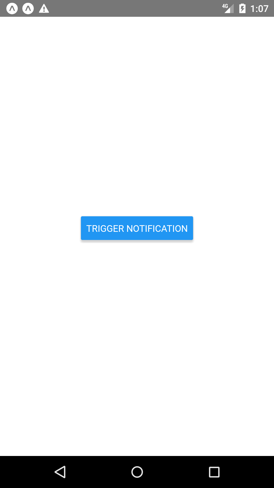
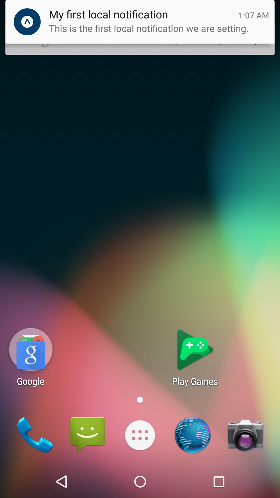

React Native Project with Notifications

Section 16 of React Native - The Practical Guide [2020 Edition]

Starting in Video 294.

# Local Notification vs Push Notification:

## Local Notification:
 - Triggered by app, displayed locally to user
 - Never sent to other users or devices
 - Example: Reminder App

## Push Notification:
 - Received by app, displayed locally to user.
 - Push notification usually trigger a local notification.
 - Not triggered by local 
 - Sent remotely to one or many users and devices.
 - Example: chat apps, email app, shopping app

# Steps
1. Video 296: Sending Local Notifications
 - Initialize Expo

 - Install expo-notifications
```
expo install expo-notifications
```

 - Add button
```jsx
<Button title="Trigger Notification" onPress={triggerNotificationHandler}/>
```

 - Import expo-notifications
```jsx
import * as Notifications from 'expo-notifications';
```

 - Create triggerNotificationHandler function
```js
const triggerNotificationHandler = () => {
  Notifications.scheduleNotificationAsync({ // Creates local notification.
    content: {
      title: 'My first local notification',
      body: 'This is the first local notification we are setting.'
    },
    trigger: {  // Define when notification should be sent
      seconds: 10
    }
  });
};
```
   - Notifications.scheduleNotificationAsync creates **local notification**.
   - In the content, you can set many things, but not all will be supported. If unsupported, it will be ignored.
   - Trigger defines **when** the notification should be sent.

 - Modify app.json
```json
"android": {
  "useNextNotificationsApi": true
}
```
   - in app.json, set/add android.useNextNotificationsApi = true

 - Test Run:


 - Note that if you click the trigger and stay in the app, you will **NOT** see the notification. You need to leave the app (or go to homescreen) to see the notification.


